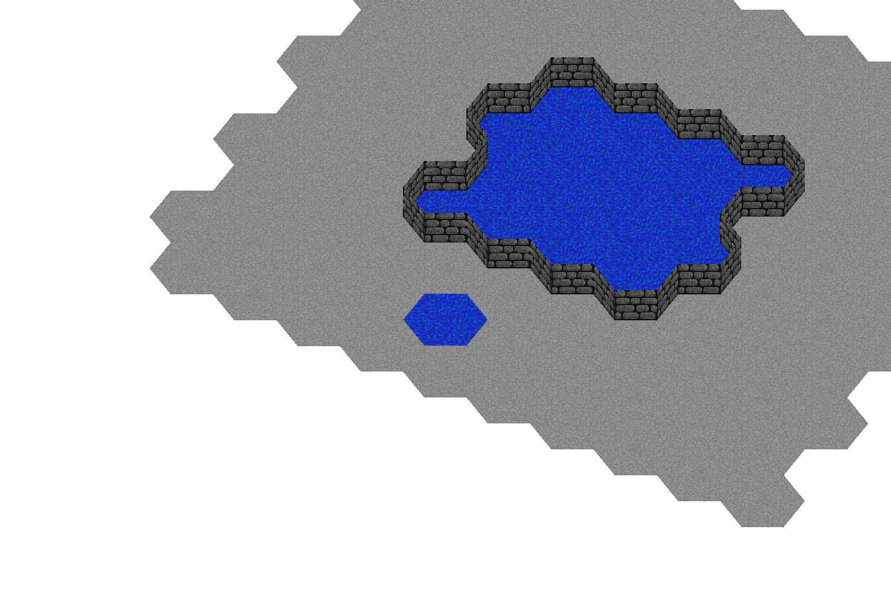

This is a small Zig project that renders a hexagonal grid with raw OpenGL. I was inspired by [this great video by javidx9](https://www.youtube.com/watch?v=Ql5VZGkL23o) about using orthographic projection to make a game that has a retro 2D art style but still allows you to change the camera angle like a 3D game. I opted for hexagons instead of squares because [hexagons are the bestagons](https://www.youtube.com/watch?v=thOifuHs6eY).

To run, install Zig 0.14.0 and do `zig build run`. It works on Windows, MacOS, and Linux. Move around with the arrow keys and change the camera angle with WASD.

